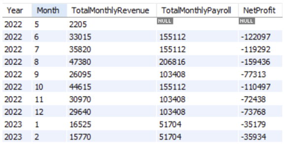

# SQL Data Modeling + BI Reporting Pipeline

## Introduction 
This SQL project example comes from a group project as part of my masters program in Business Analytics. The goal of this project was to design a relational database for a property management scenario including leases, apartments, maintenance, staff, and clients. Then we were tasked with using this databse to create business-facing queries to answer operational questions and create BI-friendly summary tables. 

## The Build
- ERD -> relational schema -> DDL
- Created core entities (e.g., APARTMENT, LEASE, MAINTENANCEREQUEST) with referential integrity.
- Answered stakeholder questions (occupancy, upcoming lease experiations, pending requests, etc.)
- Designed star schem 

## Examples: Dashboard-ready outputs
### Lease expirations by building/month for proactive renewals and capacity planning
```
SELECT LeaseID, LeaseStartDate, LeaseEndDate, AptNo, MonthlyRent
FROM Lease
WHERE LeaseEndDate <= (SELECT CURDATE() + INTERVAL 3 MONTH);
```


### Net profit by month (revenue - payroll) for leadership KPI tracking
```
CREATE TABLE Summary_NetProfitByMonth AS
SELECT
    c.Year,
    c.Month,
    SUM(r.MonthlyRent) AS TotalMonthlyRevenue,
    SUM(py.MonthlySalary) AS TotalMonthlyPayroll,
    SUM(r.MonthlyRent) - SUM(py.MonthlySalary) AS NetProfit
FROM CALENDAR c
LEFT JOIN REVENUE r
    ON c.CalendarKey = r.CalendarKey
LEFT JOIN PAYROLL py
    ON c.CalendarKey = py.CalendarKey
WHERE c.FullDate >= DATE_SUB(CURDATE(), INTERVAL 3 YEAR)
GROUP BY c.Year, c.Month
ORDER BY c.Year, c.Month;
```


## Tools and Techniques
The project was built using MySQL and featured the following techniques: 
- Joins
- Group by
- Date logic
- Summary tables
- Data modeling (ERD, normalization, star schema) 
- ETL reasoning
- Metrics design

## Links 
- [SQL Code](./sql/)
- [Schema](./schema/)
- [Outputs](./outputs/)
